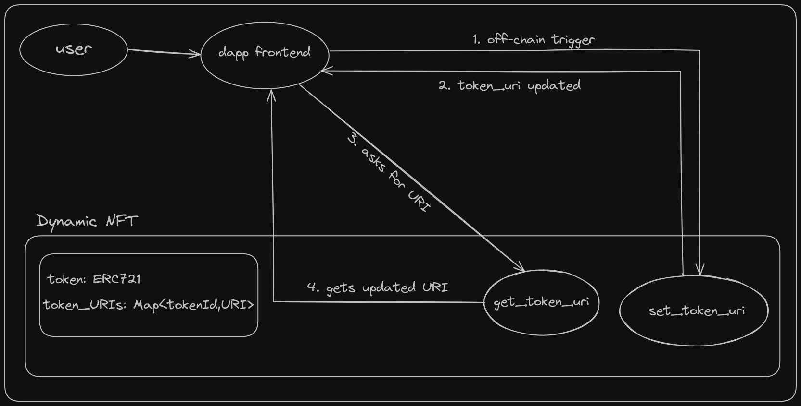

# StarkPaw

StarkPaw is an innovative on-chain pet game where you can interact with your pet NFTs directly on the blockchain. It showcases one of the best use cases of dynamic NFTs, allowing your digital pets to evolve and change based on your interactions.

## How It Was Made

The StarkPaw project is built on the StarkNet ecosystem, leveraging the Cairo programming language and the unique capabilities of dynamic NFTs. We implemented a custom dynamic NFT contract as OpenZeppelin does not currently provide one. The decentralized application (dApp) interface was developed using Next.js, and it integrates Dynamic's robust authentication system for secure user interactions.

## Dynamic NFTs

Dynamic NFTs (dNFTs) are non-fungible tokens that can change their properties or metadata over time or in response to external conditions. Unlike static NFTs, which remain the same, dynamic NFTs can evolve, making them suitable for various applications requiring real-time updates or conditional changes.

Key Features:

- **Mutable Metadata**: Metadata can be updated post-minting, including images, descriptions, and attributes.
- **External Triggers**: Respond to external events or data feeds (oracles), such as in-game progress affecting an NFT's stats.
- **Smart Contract Logic**: Updates follow predefined rules in smart contracts.
- **Interactivity**: Users can interact with dNFTs to influence their attributes, ideal for evolving digital art, collectibles, and virtual assets.

## Architecture diagram

## Importance of StarkNet

Dynamic NFTs require frequent state changes, which can be prohibitively expensive and slow on Layer 1 (L1) blockchains. StarkNet, a decentralized and permissionless zk-rollup, is specifically designed to support applications like StarkPaw. It provides several critical benefits:

- **Frequent State Changes:** Supports the high-frequency state changes required by dynamic NFTs.
- **Scalability:** StarkNet processes transactions off-chain and posts proofs to Ethereum, significantly reducing congestion and costs.
- **Sub-cent Transaction Costs:** Users enjoy extremely low transaction fees, making frequent interactions affordable.
- **Fast Finality:** Transactions achieve faster finality on Layer 1 compared to other rollups, enhancing the user experience.

## Smart Contract Addresses

The following are the smart contract addresses deployed on StarkNet Sepolia for StarkPaw:

1. **Manager:** : 0x02978a096d277edf4da2462471f2f117384cf5dcaa37d87a09dcdb06cdbe0631
2. **Dog NFT:** : 0x070d2b81433a04a24ea314fb338b6765685bf04c6feda53fc7ff41e8bdb3ab14
3. **Cat NFT:** : 0x0019b58fb2dc0f314dce97a3ff1d841252f8ef9e98135a11c4981dbafb1b23da
4. **Bunny NFT:** : 0x05a99df4291523865e3de6eee5a10f4a6e24a548cd31aeab19094349e0451dfc
